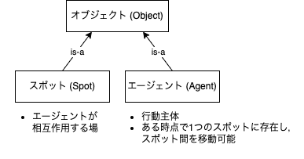
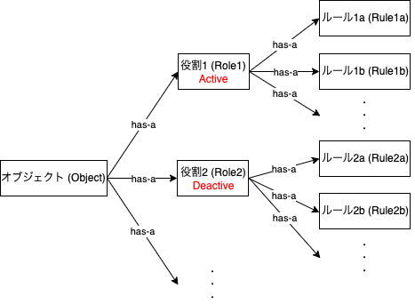
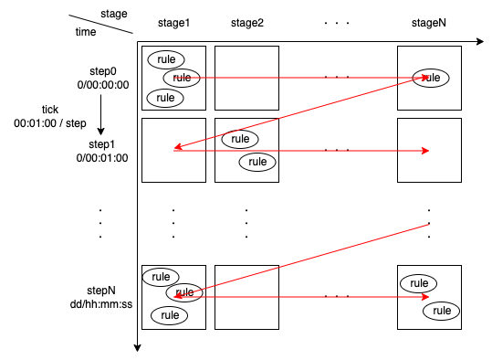

次：[sample01:最も簡単なプログラム](src/main/java/jp/soars/tutorials/sample01/)

# SOARSの基本概念 <!-- omit in toc -->

ここでは，Spot Oriented Agent Role Simulator (SOARS)の基本概念について説明する．
SOARSの主な特徴として以下のものが挙げられる．

- オブジェクト (Object)
  - エージェント (Agent)
  - スポット (Spot)
- 役割，ロール (Role)
- ルール (Rule)
- ステージ (Stage)

SOARSでは，離散時間中のあるステージで，オブジェクトが持つ役割に従ってルールを実行することでシミュレーションが進んでいく．以降はこれらの概念を詳しく説明していく．

## オブジェクト(エージェント，スポット)

オブジェクトはエージェントとスポットの総称である．
これらオブジェクトは後述する役割とルールを持つことができる意思決定主体である．

- スポット: 0以上のエージェントをもちエージェントが相互作用する場を表現している．
- エージェント: 行動主体．複数のスポット間を移動することができる．
ただし，同時に複数箇所のスポットに存在することはできない．

※ 例えば，現実世界とSNSのようにレイヤーを複数用意して，エージェントが現実世界のスポット1とSNSのスポット3に同時に存在するようなモデルを表現できる機能がサポートされているが，応用になるためここでは割愛する．

## 役割，ルール

役割はオブジェクトの属性，ルールはオブジェクトの振る舞いの最小単位を表す概念である．オブジェクトは登録されている役割とルールに従って意思決定し，シミュレーションが進んでいく．

- 役割，ロール (Role)
  - オブジェクトの属性を定義する．
  - 属性が持つ変数やルールをもち，アクティブ制御が可能でアクティブな役割に登録されているルールのみが後述するステージで実行される．
- ルール (Rule)
  - オブジェクトの振る舞いの最小単位．
  - 実際にエージェントのスポット間の移動の実行や，役割のアクティブ状態の切り替え，ルールの登録・削除，役割が持つ変数を変更・更新したりする．

ルールは実行タイミングによって以下の3種類に分類される．
定期実行ステージについては，次の章で解説する．

- ルールの種類
  - 定時実行ルール (regular rule)
    - 時刻 (hh:mm:ss) とステージ (stage) を指定することで，毎日指定した時刻の指定したステージで実行されるルール．
    - 定期実行ステージには登録できない．
  - 臨時実行ルール (temporary rule)
    - 時刻 (dd/hh:mm:ss) とステージ (stage) を指定することで，指定した時刻の指定したステージで一回のみ実行されるルール．
    - 定期実行ステージには登録できない．
  - ステージ実行ルール (stage rule)
    - ステージ (stage) に登録することでそのステージに設定された実行間隔で定期的に実行されるルール．
    - 登録するステージが定期実行ステージである必要がある．

## ステージ (Stage)

SOARSは離散時間でシミュレーションが進んでいく．
時間の分割は，時刻(time)とステージ(stage)によって行われる．
ユーザーはシミュレーション開始時刻と終了時刻，tick = 1stepの時間間隔，ステージを定義する．
図の赤矢印がルールの実行順序を表している．

ある時刻・ステージに登録されるルールは以下の制約を満たす必要がある．

- あるオブジェクトがある時刻・ステージで実行するルールは高々1つである．
  - 登録は複数してもよいが，役割のアクティブ制御などで実行されるルールを1つにする必要がある．
- ある時刻・ステージで実行されるルールは実行順序によって結果が変わってはならない．
  - ルールの実行順序によって結果が変わる場合は，ステージ分けをすることでルールの実行順序を明確にしなければならない．
  - SOARS Toolkit ライブラリはルールの実行順序を担保しない．

ユーザーがこの制約を満たしたモデリングを実装することで，ある時刻・ステージに登録されているルールは並列実行が可能となり，SOARS Toolkit ライブラリではステージごとに並列実行するか否かを指定するだけで簡単に並列化をサポートする機能を実装している．

ステージには定期実行ステージとそれ以外のステージがあり，定期実行ステージは開始時刻と実行間隔を指定することでその設定に従ってステージに登録されているルールを定期的に実行する．

次：[sample01:最も簡単なプログラム](src/main/java/jp/soars/tutorials/sample01/)
